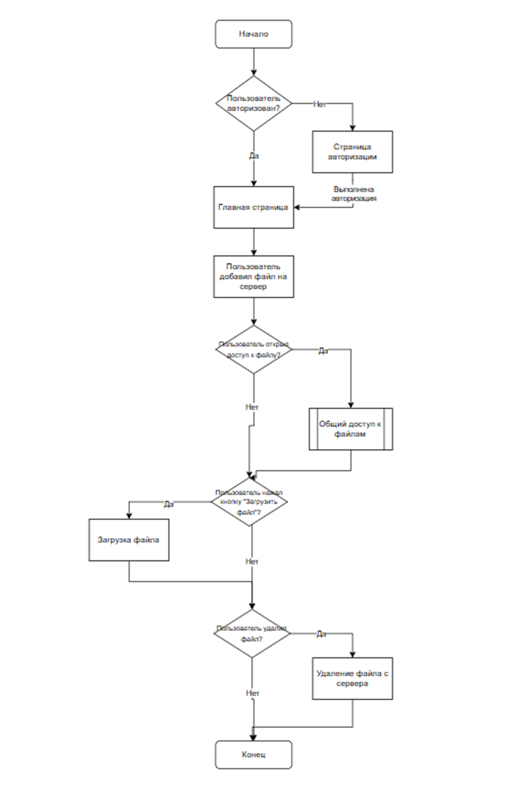
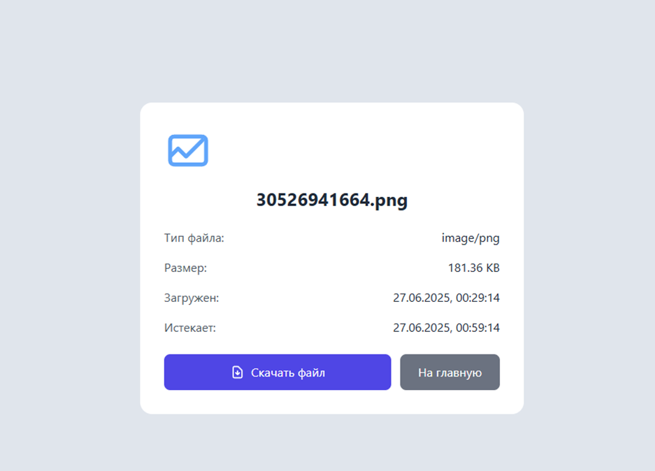

# FileIO - файлообменник с шифрованием файлов

<h4>
   Проект представляет собой клиент-серверное веб-приложение для обмена файлов
   с их хранением на сервере в зашифрованном виде
</h4>

> Приложение было создано в рамках научно-исследовательской работы

- [Алгоритм работы приложения](#algo)
- [Демонстрация работы](#demo)
- [Архитектура приложения](#arch)
- [Настройка и запуск приложения](#config)
- [Тестирование приложения](#test)

<a name="algo"/>

## Алгоритм работы приложения

### Авторизационная страница
Процесс начинается с проверки **авторизации** пользователя

Если пользователь не авторизован, система перенаправляет его на страницу авторизации, где необходимо ввести учетные данные.

После успешной авторизации пользователь попадает на главную страницу платформы.

### Главная страница
На главной странице пользователь получает возможность загрузить файл на сервер

1. После загрузки файла система предлагает пользователю выбрать - открыть ли доступ к файлу для других пользователей

2. Если пользователь решает открыть доступ, система генерирует уникальную ссылку для общего доступа к файлу. 

    Эта ссылка может быть скопирована и распространена среди других пользователей

    > Процесс общего доступа к файлам описан в пункте `Общий доступ к файлам`

3. Если пользователь не открывает доступ к файлу, система переходит к следующему шагу - **проверке необходимости удаления файла**.

    Пользователь может в любой момент **удалить** загруженный файл с сервера.

    При принятии решения об удалении файл **безвозвратно** удаляется с сервера, а все ранее сгенерированные ссылки на этот файл становятся недействительными.

4. Если пользователь не удаляет файл, процесс возвращается к этапу работы с файлами (загрузка новых или управление существующими).

5. Алгоритм завершает работу только после явного действия пользователя по удалению файла или закрытию сессии.

### Общая схема работы приложения


### Общий доступ к файлам

#### Автогенерируемые ссылки
Ключевым механизмом платформ для файлообмена является доступ других пользователей к общим файлам посредством `сгенерированных` для этого ссылок.

> Пример автоматически сгенерированной ссылки на файл с общим доступом:
> ```
> https://localhost:8080/api/file-metas/567ba1e2-7c87-44c4-939c-4ccf2b77c0c3?shared=true
> ```
> 

#### Валидация доступа к файлу

При обращении к общему файлу необходимо произвести ряд операций:
1. Проверка целостности данных и существования файла в базе
2. Проверка истечения срока жизни ссылки к файлу
3. Проверка доступа пользователя к файлу (если файл открыт не для всех пользователей)

#### Схема валидации доступа к файлу


<a name="demo"/>

## Демонстрация работы

### Главная страница


### Страница авторизации


### Модальное окно открытия доступа к файлу


### Страница для загрузки общедоступного файла


<a name="arch"/>

## Архитектура приложения

### UI приложения

Пользовательский интерфейс основан на JavaScript фреймворке `React`

Также используется библиотека стилей `Tailwind CSS` для лаконичного и актуального внешнего вида

Для адаптивной вёрстки активно применяются `CSS Grid` и `Flexbox`,
благодаря чему интерфейс корректно отображается на различных устройствах.

### API приложения

Для реализации API веб-приложения выбран стек технологий:
- `Java 21` - встроенная библиотеку для AES-256 шифрования, обеспечивающую максимальную надежность шифрования и высокую скорость преобразования файлов
- `Spring Boot 3.5.0` - возможность простой конфигурации приложения под необходимый размер входящего файла, гибкую настройку REST API контроллеров, внедрение внешних зависимостей и высокую производительность при большой нагрузке
- `PostgreSQL 17.2` - быстрый доступ к файлам (хранение метаданных о файлах)
- `MinIO Object Storage` - возможность абстрагирования системы от технических деталей, доступность, масштабируемость и гибкость

#### ER-диаграмма взаимодействия сущностей в базе данных PostgreSQL


#### Зашифрованные файлы в хранилище MinIO


<a name="config"/>

## Настройка и запуск приложения

### Установка проекта

1. Установите Docker Desktop на свой ПК (для daemon-а) https://docs.docker.com/desktop/setup/install/windows-install/
2. Установите и запустите `git bash`
3. Клонируйте репозиторий в желаемую папку

```shell
git clone https://github.com/duahifnv/file-hosting.git
cd file-hosting
```

### Настройка окружения приложения

#### Окружение продакшена

1. Создайте и настройте `.env.prod` файл (должен находится в корневой папке `file-hosting`)

   Конфигурация базы данных `PostgreSQL`
   
   ```dotenv
   POSTGRES_HOST=localhost
   POSTGRES_DB='Имя БД'
   POSTGRES_PASSWORD='Пароль к БД'
   POSTGRES_USER='Имя пользователя БД'
   POSTGRES_PORT='Порт БД'
   ```
   
   Конфигурация хранилища `MinIO`
   
   ```dotenv
   MINIO_INIT_BUCKET='Имя бакета'
   MINIO_PORT='Порт хранилища'
   MINIO_CONSOLE_PORT='Порт консоли хранилища'
   MINIO_ROOT_USER='Имя пользователя хранилища'
   MINIO_ROOT_PASSWORD='Пароль хранилища'
   ```
   
   Конфигурация JWT токена
   
   ```dotenv
   JWT_SECRET='256-битный секрет'
   ```
   
   > [!NOTE]
   > Генерировать 256-битный секрет для токена рекомендуется при помощи команды:
   > 
   > ```shell
   > openssl rand -base64 32
   > ```

2. Проверьте, что `docker daemon` запущен

   ```shell
   docker --version
   ```

3. Запустите контейнеры `PostgreSQL` и `MinIO`

   ```shell
   docker-compose -f compose.yml -f compose.prod.yml up -d 
   ```

#### Окружение разработки

1. Создайте и настройте `.env.dev` файл (должен находится в корневой папке `file-hosting`)

   > Содержание .env файла **идентично** .env из `Окружения продакшена`

2. Проверьте, что `docker daemon` запущен

   ```shell
   docker --version
   ```

3. Запустите контейнеры `PostgreSQL` и `MinIO`

   ```shell
   docker-compose -f compose.yml up -d 
   ```

### Запуск приложения

> Система предоставляет два варианта базы данных:
> 1. Встроенная in-memory база данных `H2DB`
> 2. Полноценная база данных с хранилищем `PostgreSQL` (docker-контейнер)
> 
> Выбор базы данных зависит от выбранного профиля запуска:
> 1. `h2` - для H2DB
> 2. `postgres` - для PostgreSQL


Команда запуска `Окружения продакшена`:

```shell
./mvnw clean spring-boot:run -D spring-boot.run.profiles=prod,postgres
```

Команда запуска `Окружения разработки`:

```shell
./mvnw clean spring-boot:run -D spring-boot.run.profiles=dev,h2
```

<a name="test"/>

## Тестирование приложения

Для проверки корректности работы приложения при помощи `JUnit5` были написаны тесты,
покрывающие самые важные части

Команда запуска всех `тестов`:

```shell
./mvnw clean test
```